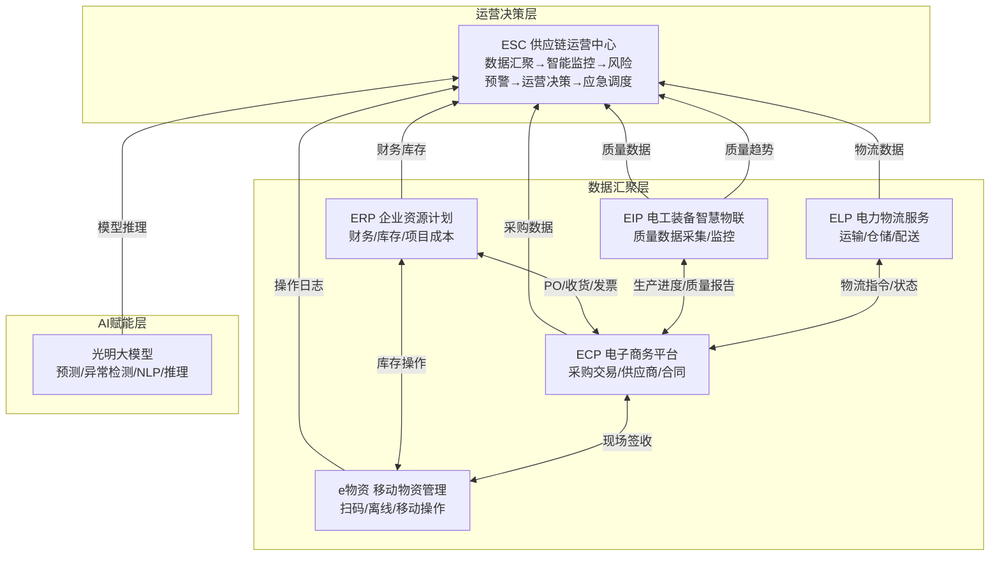
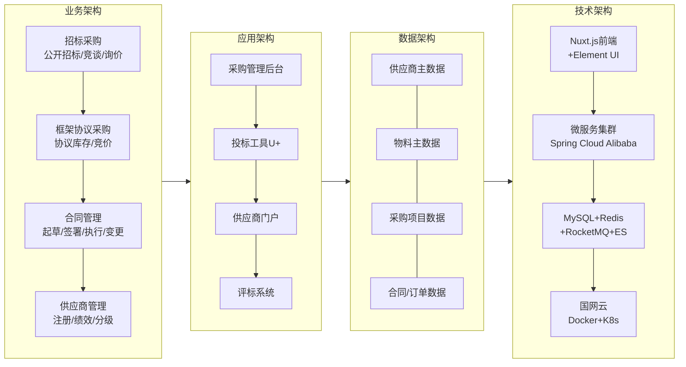
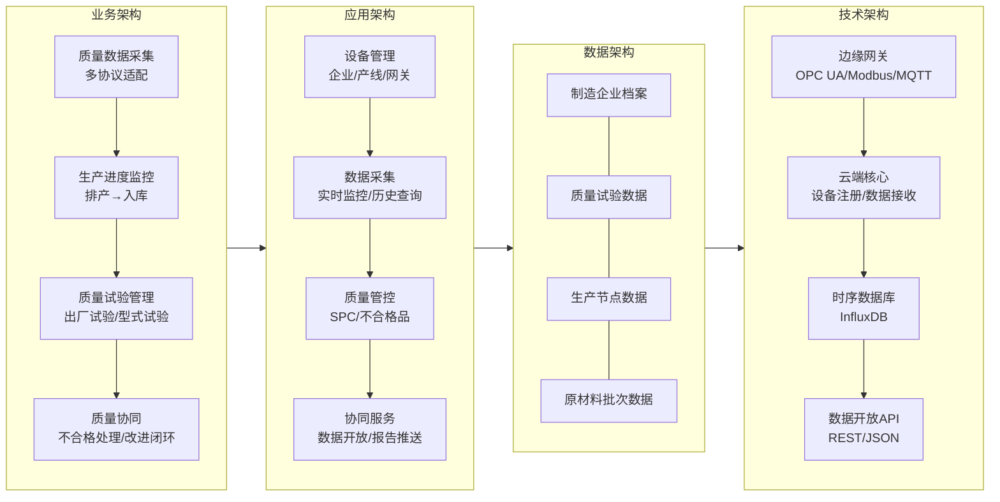
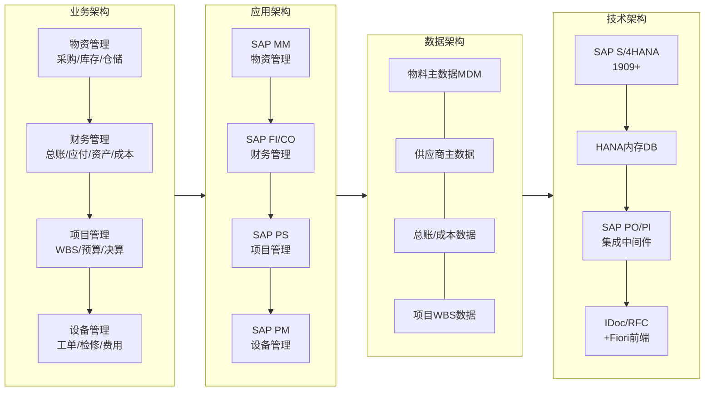
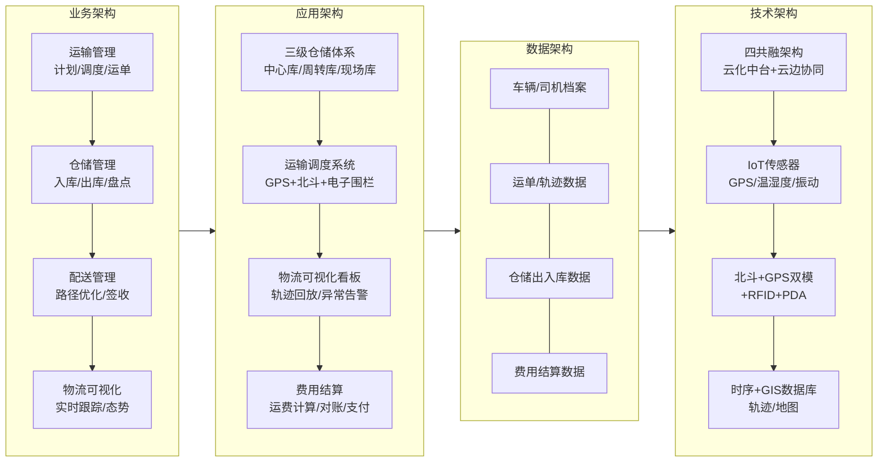
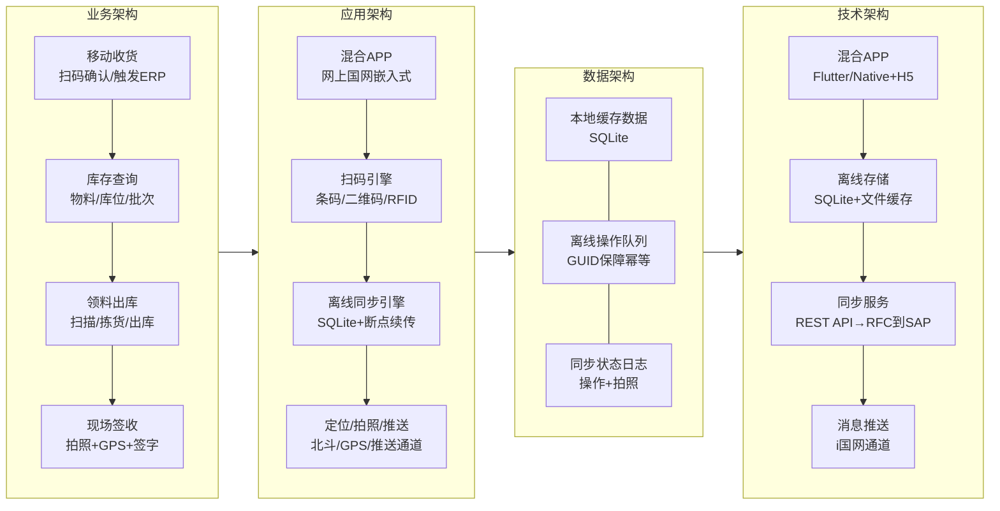
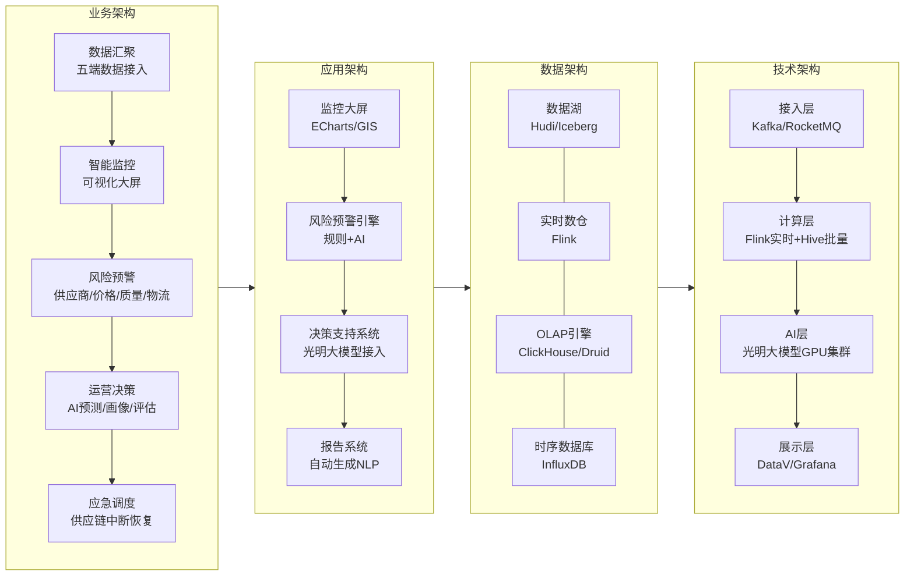
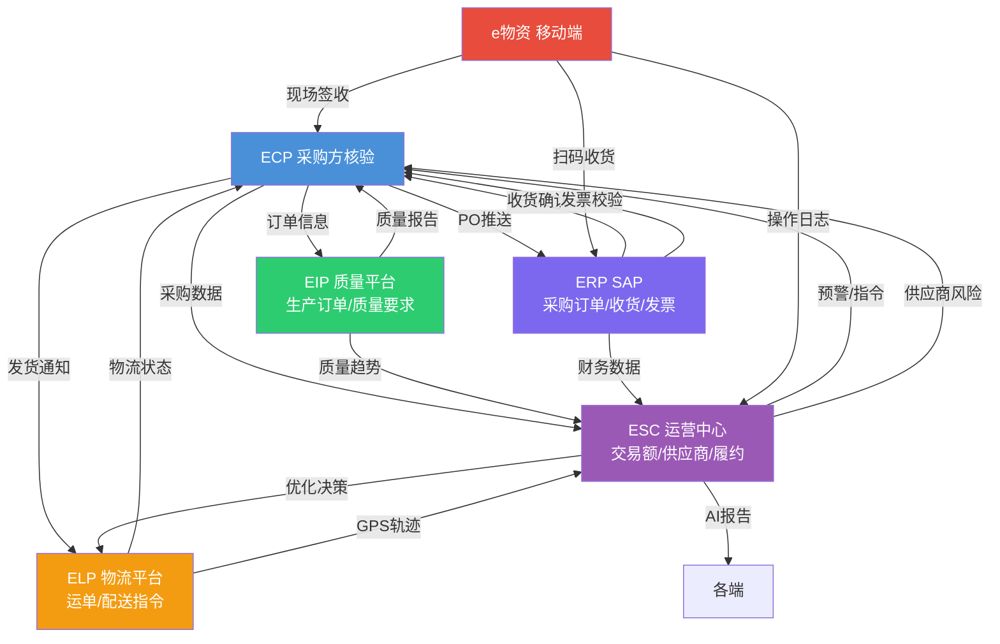

# 国网五E一中心架构图集

> 本文使用 Mermaid 语法绘制五E一中心体系架构图，支持在 Obsidian/GitHub/VS Code 等支持 Mermaid 的编辑器中渲染。
> 元信息：创建时间2026-07-20

---

## 一、五E一中心总架构图

---

## 二、各中心四层架构图

### 2.1 ECP（电子商务平台）

### 2.2 EIP（电工装备智慧物联）

### 2.3 ERP（企业资源计划）

### 2.4 ELP（电力物流服务）

### 2.5 e物资（移动物资管理）

### 2.6 ESC（供应链运营中心）

---

## 三、跨中心数据流总图

---

> 📋 本图集（architecture-diagrams.md）配合六篇深度技术说明使用，建议在支持 Mermaid 的编辑器中打开查看渲染效果。
> 如需要在 PPT 中使用，可将 Mermaid 代码复制到 <https://mermaid.live> 等在线工具导出 SVG/PNG。
