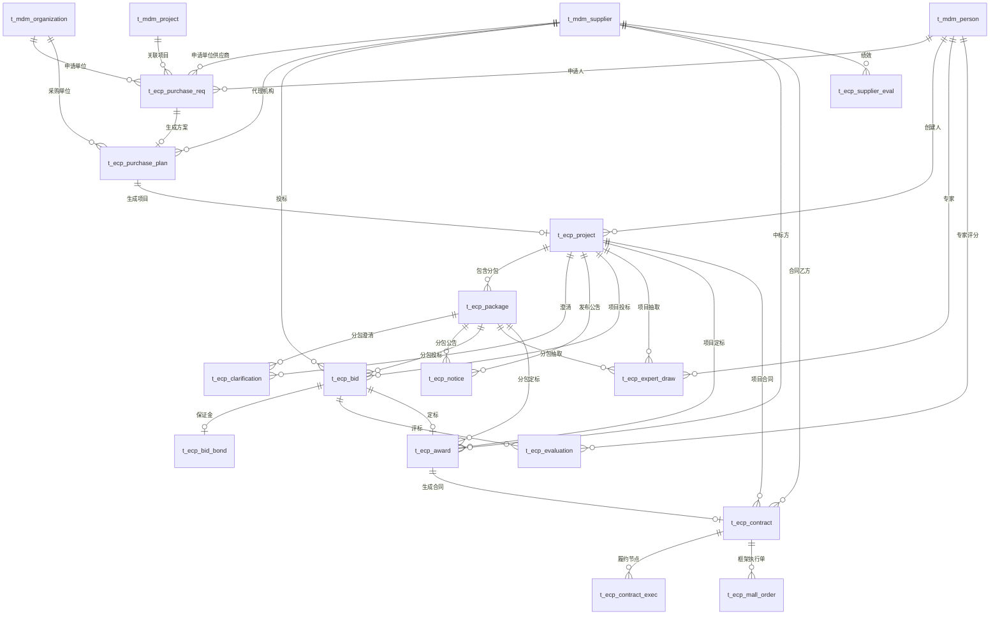
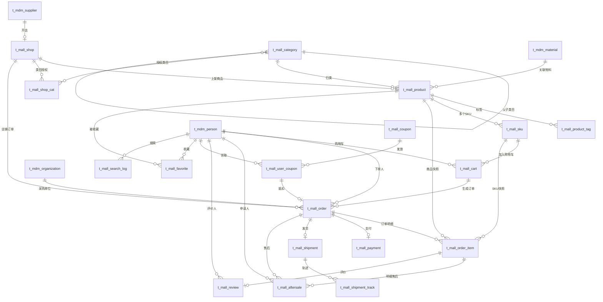
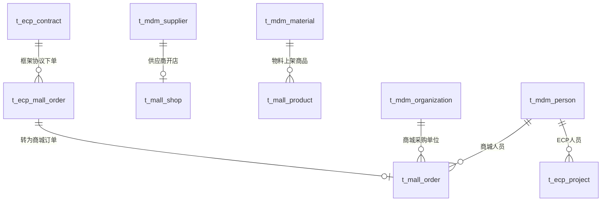

# ECP与国网商城实体关系图（ER图）

> 基于《ECP交易域数据架构设计》《国网商城电商域数据架构设计》绘制的Mermaid ER图。
> 元信息：2026-07-20

---

## 一、ECP交易域 ER图

**关系说明**：
- `||--o{` 表示一端对多端（1:N），如一个项目包含多个分包
- `||--o|` 表示一对一或一对零一（1:1/1:0..1），如方案生成项目
- 主数据（supplier/org/person/project）为各业务表的公共外键来源

---

## 二、国网商城电商域 ER图

**关系说明**：
- 商品（SPU）与SKU为一对多（1:N），一个商品多个规格
- 购物车→订单为生成关系（结算时购物车项转为订单明细）
- 订单与支付、物流、售后均为一对零一（1:0..1）
- 优惠券通过用户券中间表与订单关联

---

## 三、ECP交易域 × 商城域 跨域关系

**闭环说明**：
1. ECP合同（框架协议）→ `t_ecp_mall_order` 框架执行单 → `t_mall_order` 商城实际订单
2. MDM供应商/物料主数据被两个域共享，保证数据一致性

---

> 📋 三张ER图覆盖ECP交易域（15表）、国网商城电商域（18表）及跨域关系。
> 在 Obsidian/VS Code 中可直接渲染。如需导入PowerDesigner，可将本图转换为物理模型导入。
