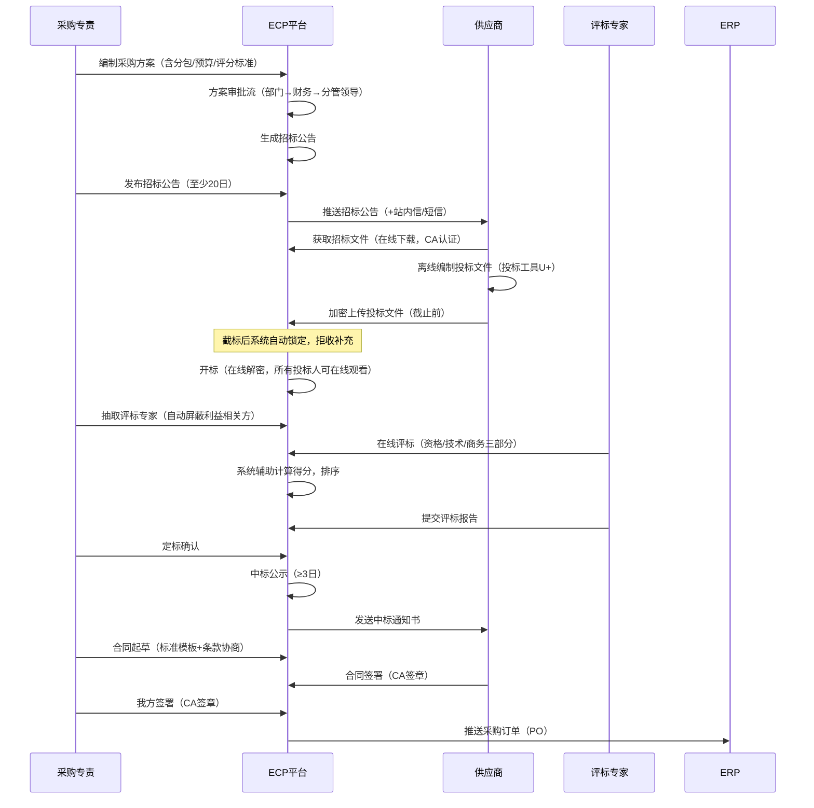
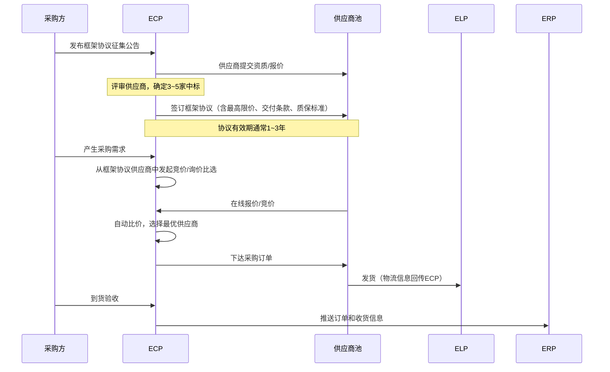
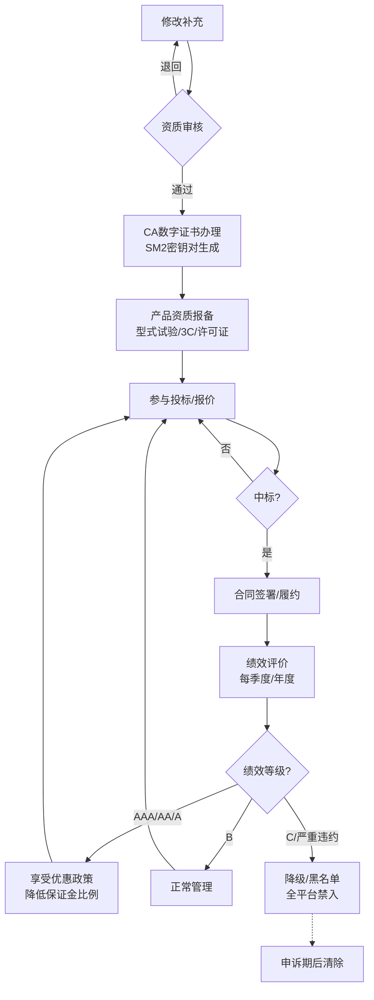
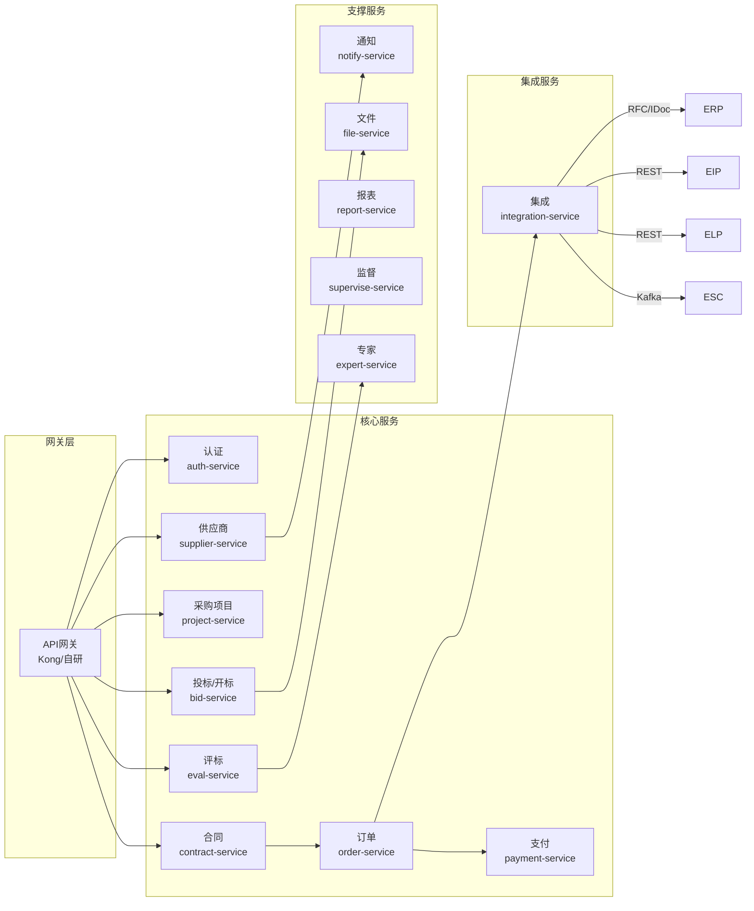

# 国网ECP2.0深度研究报告

> 本文是"逐一研究"系列的第一篇（ECP），聚焦核心流程建模、数据实体关系、接口序列和性能特征。
> 元信息：创建时间2026-07-20

---

## 一、核心业务流程建模

### 1.1 公开招标流程（最完整、最复杂的采购方式）



### 1.2 框架协议采购流程（高频、节省重复采购）



### 1.3 供应商全生命周期管理流程



---

## 二、核心数据实体关系

### 2.1 关系概览（核心7大实体）

```
┌──────────┐     ┌──────────┐     ┌──────────┐
│  采购项目  │────│   公告    │────│   投标    │
└────┬─────┘     └──────────┘     └────┬─────┘
     │                                  │
     │                                  │
┌────▼─────┐                    ┌──────▼───────┐
│   供应商   │◄───────────────────│  投标文件     │
│ (Supplier)│                    │ (离线加密上传) │
└────┬─────┘                    └──────────────┘
     │
     │
┌────▼─────┐     ┌──────────┐     ┌──────────┐
│   合同    │────│   订单    │────│   发票    │
│ (Contract)│     │ (PO)     │     │ (Invoice) │
└──────────┘     └──────────┘     └──────────┘
```

### 2.2 核心实体属性（业务视角，非全字段）

**采购项目（Procurement Project）**
```
id              CHAR(32)          PK, UUID
project_no      VARCHAR(50)       项目编号（如：SG-2026-01-001）
project_type    VARCHAR(20)       采购方式（公开招标/竞谈/询价/竞价/单一来源）
budget_amount   DECIMAL(18,2)     预算金额
currency        VARCHAR(3)        CNY
procurement_org VARCHAR(100)      采购单位
technical_book  VARCHAR(200)      技术条件书编号
bid_open_date   DATETIME          开标时间
status          VARCHAR(20)       状态（方案中/公告中/投标中/评标中/已定标/已结束）
created_at      DATETIME
updated_at      DATETIME
```

**供应商（Supplier）**
```
id              CHAR(32)          PK, UUID
unified_code    VARCHAR(18)       统一社会信用代码
name            VARCHAR(200)      企业名称
legal_person    VARCHAR(50)       法人代表
reg_capital     DECIMAL(18,2)     注册资金
reg_date        DATE              成立日期
qual_level      VARCHAR(10)       资质等级（AAA/AA/A/B/C）
ca_cert_sn      VARCHAR(100)      CA证书序列号
status          VARCHAR(20)       状态（注册/审核中/通过/暂停/黑名单）
performance_score DECIMAL(5,2)    绩效评分（满分100）
```

**合同（Contract）**
```
id              CHAR(32)          PK, UUID
contract_no     VARCHAR(50)       合同编号
supplier_id     CHAR(32)          FK → Supplier
project_id      CHAR(32)          FK → ProcurementProject
total_amount    DECIMAL(18,2)     合同总金额
delivery_date   DATE              约定交货日期
signed_date     DATE              签署日期
status          VARCHAR(20)       状态（起草/签署中/已签署/执行中/已完成/已终止）
payment_terms   VARCHAR(200)      付款条件
attachment_url  VARCHAR(500)      合同文件存储路径
```

---

## 三、性能与容量特征（推断）

| 维度 | 估算数值 | 说明 |
|------|---------|------|
| **月交易额** | 数百亿级 | 国网年度采购数千亿，月均数百亿 |
| **日均采购项目** | 数百个 | 含各省/各品类 |
| **注册供应商** | 数十万家 | 历年中标+潜在供应商 |
| **并发投标** | 每项目数十家 | 热门标段可达100+投标人 |
| **开标并发** | 准实时 | 截标后在线解密，数十并发 |
| **文件存储** | 数十TB+ | 投标文件+合同PDF+资质证照 |
| **接口吞吐** | 数万RPM | 与ERP/EIP/ELP实时交互 |
| **搜索索引** | 数千万文档 | 招标公告+供应商档案全文检索 |
| **系统可用性** | 99.9%+ | 央企关键系统，双活部署 |

---

## 四、与ERP集成接口细则（以PO推送为例）

### 4.1 PO推送接口

```
ECP → ERP | 接口名: SEND_PO_TO_ERP
触发时机: 合同签署后（或订单确认后）
协议: SAP IDoc ORDERS05 / REST（经SAP PI转换）

请求体（推测JSON结构）:
{
  "interfaceId": "ECP_PO_CREATE_20260720_001",
  "timestamp": "2026-07-20T10:30:00+08:00",
  "poData": {
    "poNumber": "PO-2026-SG-001",
    "poType": "NB",
    "contractNo": "SG-2026-001",
    "supplier": {
      "code": "SC-2026-001",
      "name": "XX变压器有限公司",
      "unifiedCode": "91110000XXXXXXXXXX"
    },
    "items": [
      {
        "lineNo": 10,
        "materialCode": "SGM-2026-001234",
        "materialDesc": "110kV变压器, 50MVA",
        "quantity": 5,
        "unit": "台",
        "unitPrice": 850000.00,
        "currency": "CNY",
        "deliveryDate": "2026-09-30",
        "plant": "1001",
        "storageLoc": "W001"
      }
    ],
    "headerText": "XX项目2026年度第一批设备采购",
    "paymentTerms": "0001",
    "incoterms": "DDP"
  },
  "signature": "CA签名值"
}

响应（ACK确认）:
{
  "status": "SUCCESS",
  "erpPoNumber": "4500123456",
  "message": "PO created in SAP"
}
或
{
  "status": "FAILED",
  "erpPoNumber": null,
  "errorCode": "MATERIAL_NOT_FOUND",
  "errorMessage": "物料SGM-2026-001234在主数据中不存在"
}
```

---

## 五、用户故事集（产品规划参考）

### 5.1 采购方角度

| 用户故事 | 优先级 |
|---------|--------|
| 作为采购专责，我希望在线完成从采购方案到合同签署的全流程，避免纸质流转 | P0 |
| 作为采购专责，我希望框架协议签约后每次需要物资时直接下单而不重新招标 | P0 |
| 作为采购专责，我希望在线查看供应商的生产进度和质量报告，减少现场催货 | P1 |
| 作为采购专责，我希望系统自动提醒我即将到期的合同/需要续签的协议 | P1 |
| 作为采购经理，我希望有采购驾驶舱可随时查看采购总额、节约率、供应商表现 | P0 |

### 5.2 供应商角度

| 用户故事 | 优先级 |
|---------|--------|
| 作为供应商，我希望一次注册提交后可以参与所有省公司的投标，不用重复注册 | P0 |
| 作为供应商，我希望在线查看我的投标进度、中标结果和合同执行情况 | P0 |
| 作为供应商，我希望通过移动端接收招标/中标/合同签署等消息推送 | P1 |
| 作为供应商，我希望在线提交发票、查看付款进度 | P1 |
| 作为供应商，我希望在线完成CA证书办理和续期 | P2 |

### 5.3 管理层角度

| 用户故事 | 优先级 |
|---------|--------|
| 作为物资部经理，我希望看采购数据全览（按品类/省/供应商维度） | P0 |
| 作为管理层，我希望系统主动推送供应商风险（经营异常/法律诉讼） | P0 |
| 作为管理层，我希望AI辅助生成月度采购分析报告 | P2 |

---

## 六、ECP微服务接口依赖图



---

> 📋 本文基于已入库的六篇深度技术说明、《国网ECP2.0操作手册知识笔记》及行业知识综合编制。实体字段定义、性能数据、接口细节为基于业务推断（标注📋），非官方精确数据。
> 下一篇预告：EIP（电工装备智慧物联平台）深度研究报告
