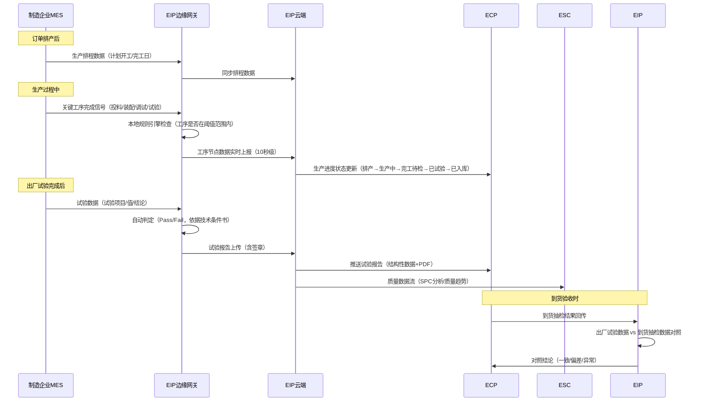
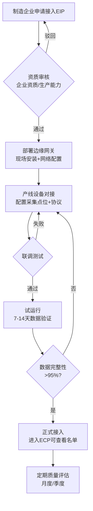
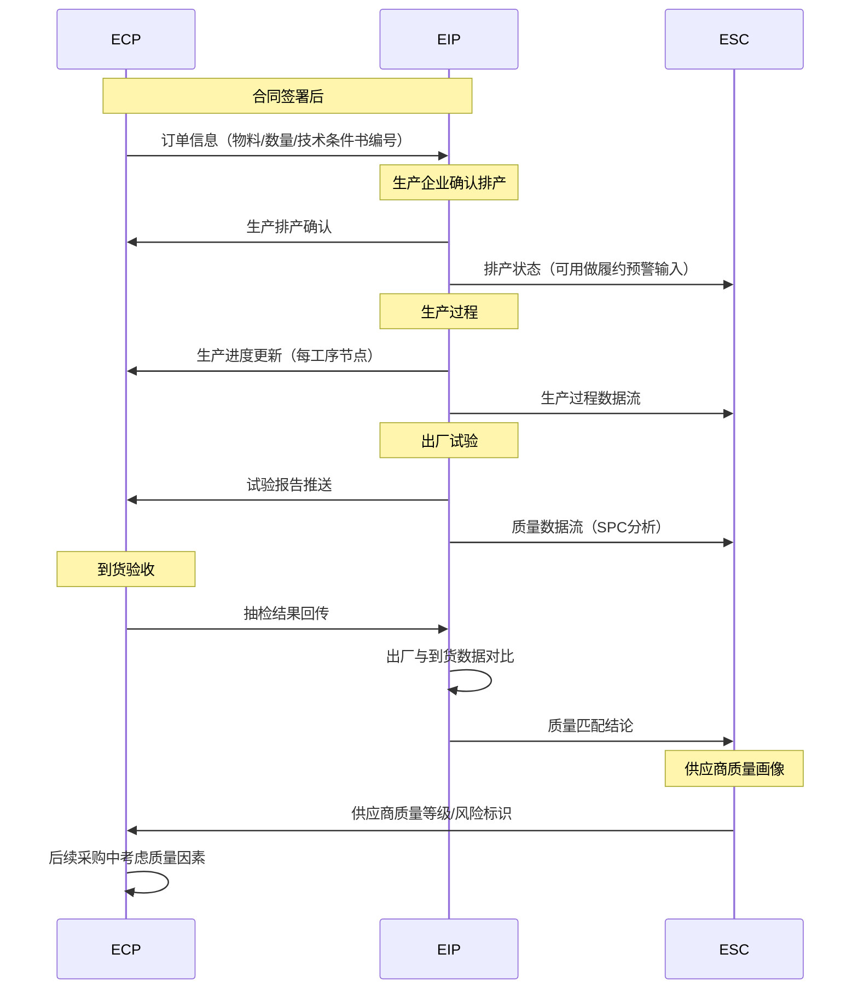

# 国网EIP深度研究报告

> "逐一研究"系列第二篇 —  EIP的数据采集流程建模、边缘计算架构、质量数据实体关系及与ECP的深度集成。
> 元信息：创建时间2026-07-20

---

## 一、核心业务流程建模

### 1.1 质量数据采集全流程



### 1.2 接入网关注册流程



---

## 二、边缘网关架构

### 2.1 硬件配置（推断）

| 组件 | 配置 | 说明 |
|------|------|------|
| **CPU** | ARM Cortex-A72 / x86 四核 | 工业级，低功耗 |
| **内存** | 4-8GB | 支撑本地缓存和数据预处理 |
| **存储** | 64-128GB SSD | 断网时可缓存7天数据 |
| **通信** | 4G/5G + 以太网 | 双链路冗余 |
| **工业接口** | RS485 / RJ45 / USB | 对接PLC/检测设备 |
| **安全芯片** | 国密SM2/SM4 | 数据加密传输 |

### 2.2 软件栈

```
应用层: 数据采集Agent / 本地规则引擎 / 远程配置Agent
中间层: MQTT Client / OPC UA Client / Modbus TCP Stack
系统层: Linux (Yocto/Ubuntu Core) / Docker容器
安全层: 国密SDK / VPN Client / 防火墙
```

---

## 三、核心数据实体

**制造企业（Manufacturer）**
```
id              CHAR(32)          PK
name            VARCHAR(200)      企业名称
unified_code    VARCHAR(18)       统一社会信用代码
province        VARCHAR(50)       所属省份
product_categories VARCHAR(500)   产品品类（变压器/开关柜/电缆...）
gateway_count   INT               边缘网关数量
access_date     DATE              接入日期
status          VARCHAR(20)       状态（试运行/正式/暂停）
quality_grade   VARCHAR(10)       质量评级
```

**质量试验数据（TestData）**
```
id              CHAR(32)          PK
order_no        VARCHAR(50)       ECP/PO订单号
product_code    VARCHAR(50)       产品物料编码
serial_no       VARCHAR(100)      产品序列号
test_item_code  VARCHAR(50)       试验项目编码
test_item_name  VARCHAR(100)      试验项目名称
test_value      DECIMAL(18,4)     试验值
unit            VARCHAR(20)       单位
lower_limit     DECIMAL(18,4)     下规范限
upper_limit     DECIMAL(18,4)     上规范限
result          VARCHAR(10)       PASS/FAIL
test_time       DATETIME          试验时间
test_device_id  VARCHAR(50)       试验设备ID
operator        VARCHAR(50)       试验操作人
report_url      VARCHAR(500)      试验报告PDF路径
```

---

## 四、与各中心的集成序列



---

## 五、对ECP产品规划的关键洞察

| EIP能力 | 远光ECP可借鉴的轻量化方案 | 技术难度 |
|---------|------------------------|---------|
| 边缘数据采集 | 供应商Web填报+拍照上传（代替硬件网关） | 低 |
| 质量数据自动比对 | 出厂报告与到货照片的人工+AI辅助比对 | 中 |
| 产线进度透明 | 供应商在Web端手动更新关键节点（5-8个里程碑） | 低 |
| 质量趋势分析 | 基于Excel/轻量BI的数据分析模板 | 低 |
| 试验报告核验 | PDF上传+关键字段提取（OCR/NLP） | 中 |

> 📋 本文基于EIP平台公开资料、专利分析和行业通用物联网架构编制。
> 下一篇预告：ERP深度研究报告
