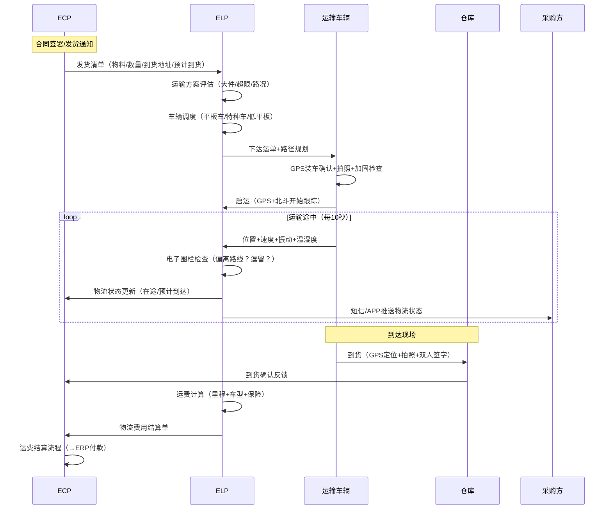
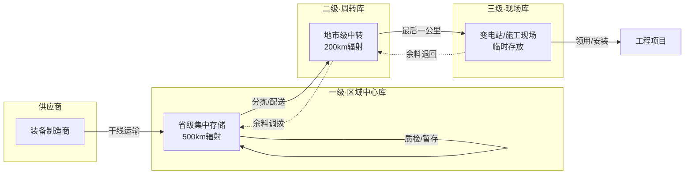
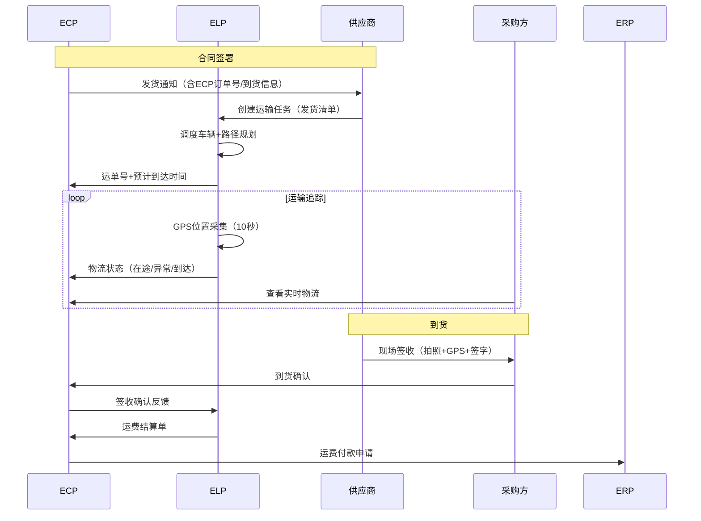

# 国网ELP深度研究报告

> "逐一研究"系列第四篇 — ELP的物流全流程建模、三级仓储体系、GPS+IoT数据模型及与ECP的协同。
> 元信息：创建时间2026-07-20

---

## 一、核心业务流程建模

### 1.1 大件电力物资运输全流程



### 1.2 三级仓储体系流转



---

## 二、核心数据实体

**运单（Shipment Order）**
```
id              CHAR(32)          PK
shipment_no     VARCHAR(50)       运单号
ecp_order_no    VARCHAR(50)       ECP订单号（关联）
supplier_id     CHAR(32)          FK→供应商
from_warehouse  VARCHAR(50)       起运仓库
to_location     VARCHAR(200)      到货地址（详细）
contact_person  VARCHAR(50)       收货联系人
contact_phone   VARCHAR(20)       联系电话
planned_departure DATETIME        计划发运时间
planned_arrival  DATETIME         计划到达时间
actual_departure DATETIME         实际发运时间
actual_arrival   DATETIME         实际到达时间
vehicle_id      VARCHAR(50)       车辆ID
driver_id       VARCHAR(50)       司机ID
status          VARCHAR(20)       状态（待调度/运输中/已签收/异常）
estimated_cost  DECIMAL(10,2)     预估运费
actual_cost     DECIMAL(10,2)     实际运费
```

**GPS轨迹点（GPS Track Point）**
```
id              CHAR(32)          PK
shipment_id     CHAR(32)          FK→运单
timestamp       DATETIME          采集时间
latitude        DECIMAL(10,6)     纬度
longitude       DECIMAL(10,6)     经度
speed           DECIMAL(5,2)      速度 km/h
direction       DECIMAL(5,2)      方向角
vibration       DECIMAL(5,2)      振动幅度（g）
temperature     DECIMAL(5,2)      温湿度（℃）
humidity       DECIMAL(5,2)       湿度（%）
fence_status    VARCHAR(10)       围栏状态（IN/OUT）
battery_level   INT               车载终端电量
```

---

## 三、与ECP协同序列图



---

## 四、对ECP的差异化机会

| ELP能力 | 远光ECP轻量方案 | 优先级 |
|---------|---------------|--------|
| GPS全程跟踪 | 对接快递100/菜鸟API，自动获取轨迹 | P0 |
| 三级仓储 | 如不涉及实物，可不建；如涉及，先做二级（中心+现场） | P3 |
| 电子围栏 | 地图API（高德/百度）+ 规则引擎 | P2 |
| 异常处理 | 物流异常自动告警（超时/偏航） | P1 |
| 运费结算 | 与订单关联，统一结算视图 | P2 |

> 📋 本文基于国网ELP公开论文《电力物流服务平台"四共融"架构设计》及行业通用物流平台实践编制。
> 下一篇预告：e物资深度研究报告
