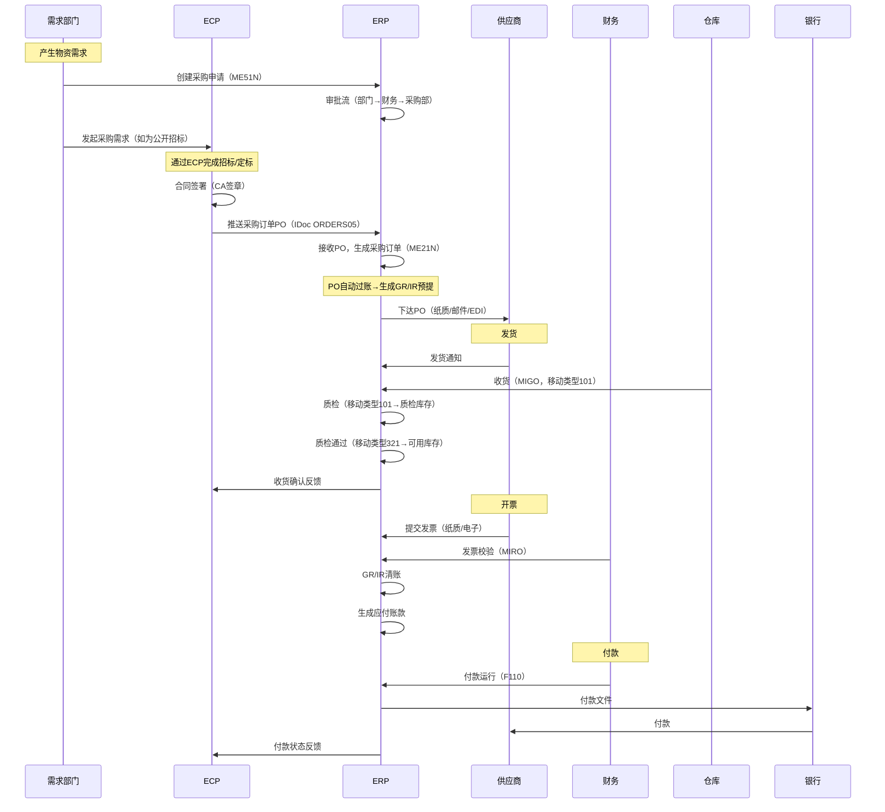
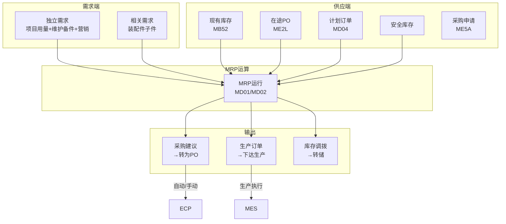
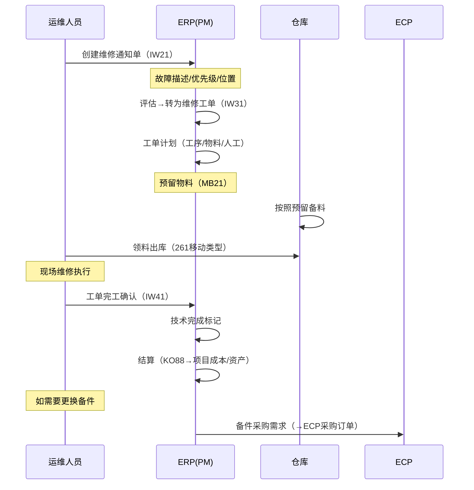

# 国网ERP深度研究报告

> "逐一研究"系列第三篇 — ERP的核心流程建模（P2P、MRP、维修工单）、关键SAP事务代码、与ECP的交互细节。
> 元信息：创建时间2026-07-20

---

## 一、核心业务流程建模

### 1.1 采购到付款（P2P）全流程

### 1.2 库存管理与MRP（物料需求计划）

### 1.3 设备维修工单流程

---

## 二、关键SAP事务代码清单

| TCode | 功能 | 模块 | 使用频率 |
|-------|------|------|---------|
| ME21N | 创建采购订单 | MM | ⭐⭐⭐⭐⭐ |
| ME22N | 修改采购订单 | MM | ⭐⭐⭐⭐ |
| MIGO | 收货/发货/转储（综合事务） | MM | ⭐⭐⭐⭐⭐ |
| MIRO | 发票校验 | MM-FI | ⭐⭐⭐⭐⭐ |
| ME5A | 显示采购申请清单 | MM | ⭐⭐⭐⭐ |
| MB52 | 库存概览 | MM | ⭐⭐⭐⭐⭐ |
| MB1B | 转储过账 | MM | ⭐⭐⭐ |
| MD04 | 库存/需求清单（MRP视图） | MM-PP | ⭐⭐⭐⭐⭐ |
| FBL1N | 供应商行项目 | FI | ⭐⭐⭐⭐ |
| F110 | 自动付款 | FI | ⭐⭐⭐ |
| IW31 | 创建维修工单 | PM | ⭐⭐⭐⭐ |
| CJ20N | 项目预算/成本 | PS | ⭐⭐⭐ |
| KO88 | 订单结算 | CO | ⭐⭐⭐ |

---

## 三、ERP与各中心的接口数据字典

### 3.1 ERP → ECP（回传接口）

| 数据项 | IDoc类型 | 字段数 | 触发时机 |
|--------|---------|-------|---------|
| 收货确认 | DESADV05 | ~30 | MIGO收货过账后 |
| 发票校验 | INVOIC02 | ~25 | MIRO过账后 |
| 付款状态 | REMADV | ~15 | F110付款执行后 |
| 物料主数据更新 | MATMAS05 | ~50 | 物料创建/变更时 |
| 供应商主数据更新 | CREMAS | ~40 | 供应商创建/变更时 |

### 3.2 ECP → ERP（下发接口）

| 数据项 | IDoc类型 | 字段数 | 触发时机 |
|--------|---------|-------|---------|
| 采购订单 | ORDERS05 | ~40 | ECP合同签署后 |
| 订单变更 | ORDCHG | ~30 | 合同变更后 |
| 订单取消 | — | ~10 | 合同终止后 |

---

## 四、ERP与ECP集成关键差异点

| 场景 | ECP视角 | ERP视角 | 集成要点 |
|------|---------|---------|---------|
| **PO创建** | 合同签署后即确认 | 需要预算检查+供应商主数据校验 | ECP需要先同步供应商/物料主数据 |
| **收货** | 到货验收是采购环节结束 | MIGO收货是库存/财务起点 | 数据需实时双向同步 |
| **发票** | 供应商提交发票即完成 | MIRO校验后才确认 | 发票状态回传ECP供供应商查看 |
| **退货** | 生成退换货单 | 退货PO+质检判定 | 退货流程需跨系统一致性 |
| **付款** | 供应商最关心的问题 | F110批量运行+银企直连 | 付款计划/状态透明化 |

> 📋 本文基于SAP行业标准功能、已入库的《SAP MM电力行业应用知识笔记》及国网ERP通用实践编制。
> 下一篇预告：ELP深度研究报告
