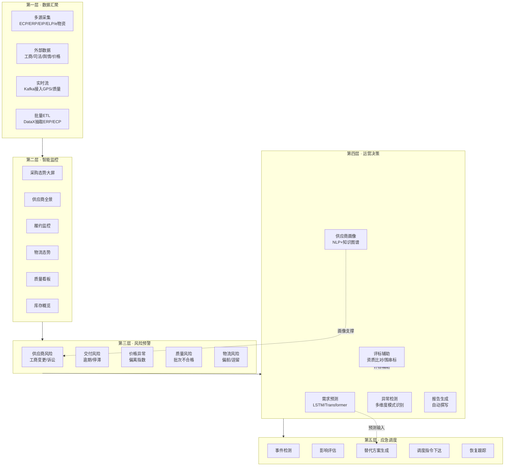
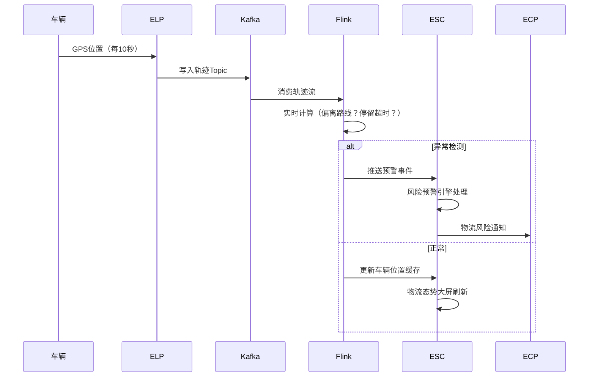
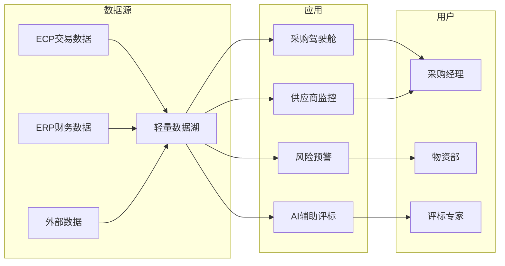

# 国网ESC深度研究报告

> "逐一研究"系列第六篇（收官）— ESC的五层能力流转建模、数据中台架构、光明大模型集成细节及AI运营中心实现。
> 元信息：创建时间2026-07-20

---

## 一、五层能力流转建模



---

## 二、数据中台技术架构

### 2.1 分层架构

```
┌─────────────────────────────────────────┐
│            应用层（ESC Applications）       │
│  监控大屏 │ 风险预警 │ 决策支持 │ 报告 │ 应急 │
└────────────────────┬────────────────────┘
                     ↓
┌─────────────────────────────────────────┐
│            分析层（AI & Analytics）         │
│  光明大模型（NLP/预测/推理）               │
│  ├─ 需求预测模型（LSTM/Transformer）      │
│  ├─ 供应商风险评估（XGBoost/知识图谱）    │
│  ├─ 价格异常检测（孤立森林/自编码器）      │
│  └─ 文本分析（招标NLP/舆情NLP）           │
└────────────────────┬────────────────────┘
                     ↓
┌─────────────────────────────────────────┐
│            数据层（Data Platform）         │
│  ┌────────┐ ┌──────┐ ┌──────┐ ┌──────┐ │
│  │ 数据湖  │ │实时数仓│ │ OLAP │ │ 时序 │ │
│  │ Hudi   │ │Flink │ │ClickH│ │Influx│ │
│  └────────┘ └──────┘ └──────┘ └──────┘ │
│        数据总线：Kafka/RocketMQ           │
└────────────────────┬────────────────────┘
                     ↓
┌─────────────────────────────────────────┐
│            接入层（Data Ingestion）        │
│  ECP │ ERP │ EIP │ ELP │ e物资 │ 外部    │
└─────────────────────────────────────────┘
```

### 2.2 实时计算流程（以GPS轨迹为例）



---

## 三、光明大模型集成细节

### 3.1 接入场景与模型分工

| 场景 | 模型类型 | 输入 | 输出 |
|------|---------|------|------|
| 需求预测 | 时间序列/Transformer | 历史采购+项目计划+季节因子 | 未来N月需求量 |
| 供应商画像 | NLP + 知识图谱 | 资质PDF/业绩/舆情新闻 | 结构化画像+风险标签 |
| 评标辅助 | NLP + 规则引擎 | 投标文件/资质证照 | 资质符合性判定+异常标记 |
| 异常检测 | 无监督学习 | 多维度运营数据 | 异常模式+置信度 |
| 报告生成 | 大语言模型 | 结构化数据+模板 | 自然语言运营报告 |

### 3.2 集成架构

```
ESC应用层
  ↓ (调用推理服务)
光明大模型推理网关
  ├─ 模型路由（按场景选择模型）
  ├─ 请求队列（削峰填谷）
  ├─ 结果缓存（相似查询复用）
  └─ 审计日志（所有AI调用留痕）
  ↓
GPU推理集群（NVIDIA，国家电网信通云）
```

---

## 四、对ECP的差异化机会（轻量运营中心）

### 4.1 三阶段建设路线

| 阶段 | 能力 | 技术实现 | 投资 |
|------|------|---------|------|
| **L1·看数据** | 采购驾驶舱 | ECharts + 关系型DB聚合 | 低 |
| **L2·管风险** | 预警+供应商风险 | 规则引擎+外部API | 中 |
| **L3·AI辅助** | 预测/画像/辅助评标 | 推荐模型+NLP+知识图谱 | 高 |

### 4.2 远光ECP"轻量ESC"核心模块



> 📋 本文基于国网供应链运营中心公开资料、光明大模型应用场景及数据中台行业实践编制。
> 全文完 — 五E一中心逐一研究系列（ECP/EIP/ERP/ELP/e物资/ESC）已全部完成。
