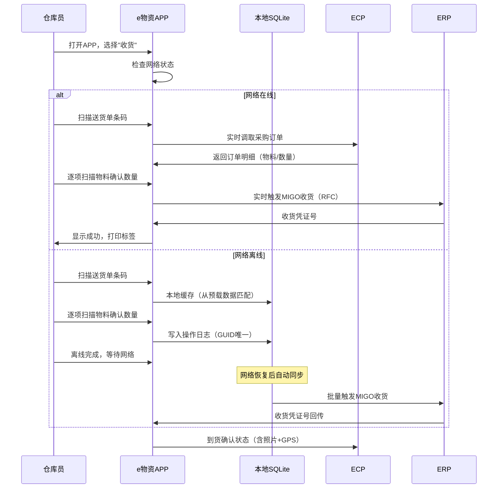
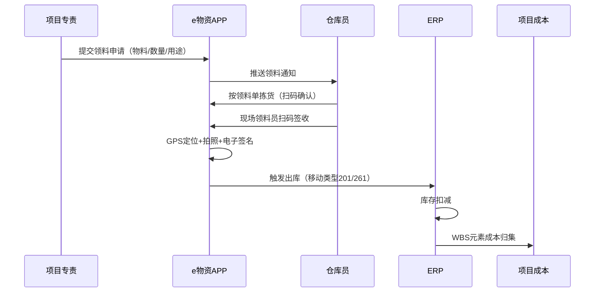
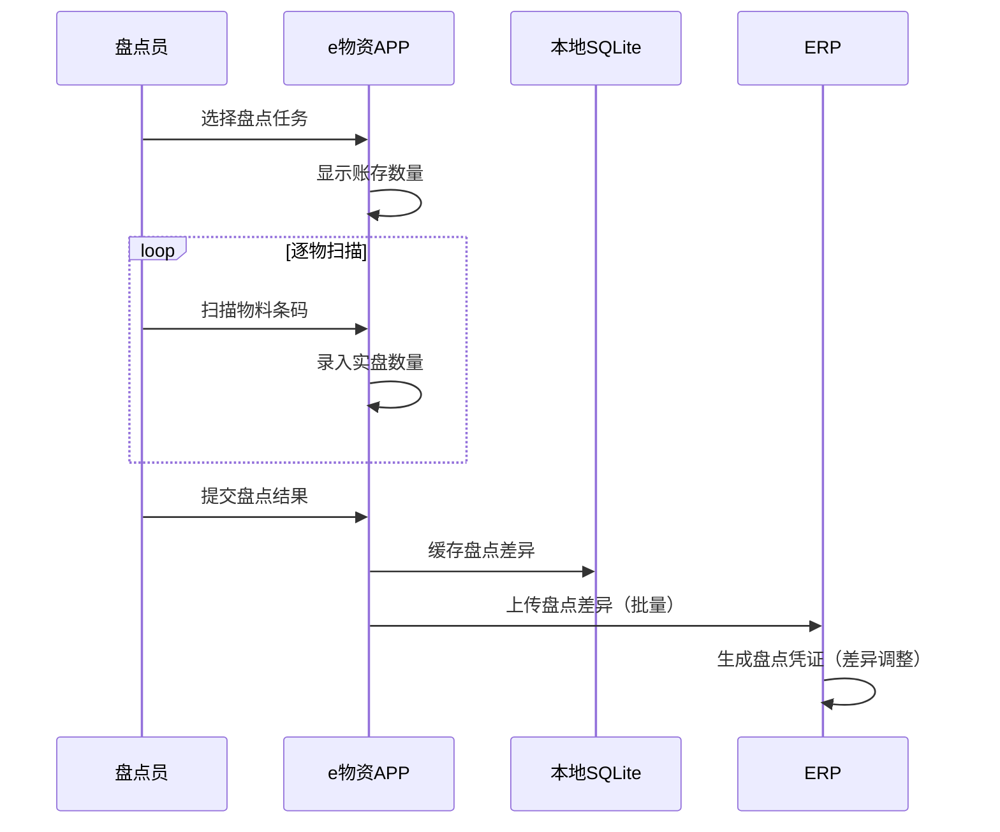
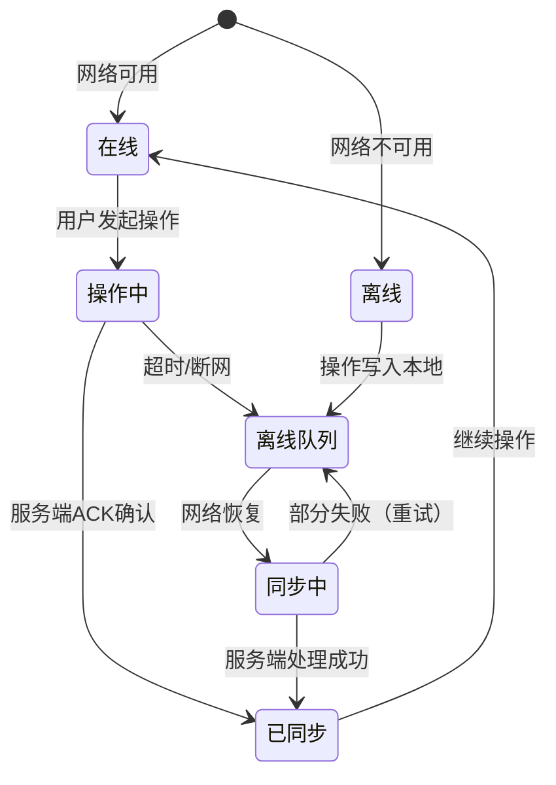

# 国网e物资深度研究报告

> "逐一研究"系列第五篇 — e物资的移动端交互流程、离线同步机制、扫码操作序列及与ERP/ECP的协同。
> 元信息：创建时间2026-07-20

---

## 一、核心交互流程建模

### 1.1 移动端收货流程（离线优先）



### 1.2 现场领料流程



### 1.3 库存盘点流程



---

## 二、离线同步架构

### 2.1 同步状态机



### 2.2 冲突解决策略

| 冲突场景 | 解决策略 | 说明 |
|---------|---------|------|
| 同一物料被多人同时盘点 | 以最后上传为准，服务端版本号控制 | 乐观锁 |
| 离线操作重复上传 | GUID去重，服务端幂等处理 | 唯一约束 |
| 网络抖动导致半完成 | 本地事务+服务端确认机制 | 两阶段 |
| 数据版本过期 | 服务端返回新版本，客户端重新拉取 | 版本校验 |

---

## 三、核心数据实体

**移动操作日志（Mobile Op Log）**
```
id              CHAR(32)          PK, UUID（GUID保证幂等）
user_id         CHAR(32)          FK→用户
op_type         VARCHAR(20)       操作类型（RECEIVE/DELIVER/COUNT/SIGN）
order_no        VARCHAR(50)       关联单据号
material_code   VARCHAR(50)       物料编码
quantity        DECIMAL(10,3)     操作数量
photo_url       VARCHAR(500)      现场照片路径
gps_lat         DECIMAL(10,6)     纬度
gps_lng         DECIMAL(10,6)     经度
sign_data       VARCHAR(500)      电子签名数据
local_time      DATETIME          本地操作时间
sync_status     VARCHAR(10)       同步状态（PENDING/DONE/FAILED）
sync_time       DATETIME          同步时间
```

---

## 四、对ECP的差异化机会

| e物资能力 | 远光ECP方案 | 优先级 |
|---------|------------|--------|
| 微信小程序 | 基于企业微信/微信小程序开发，免安装 | P0 |
| 扫码驱动 | 微信原生扫码API+二维码标准 | P0 |
| 离线优先 | 小程序Storage+断点续传 | P1 |
| 移动审批 | 微信模板消息推送+审批按钮 | P0 |
| 拍照+GPS+签字 | 微信JS-SDK能力 | P1 |
| AI辅助 | 拍照识别物料铭牌（OCR） | P2 |

> 📋 本文基于"网上国网"APP公开功能、通用移动物资管理实践及混合APP技术架构编制。
> 下一篇预告：ESC深度研究报告
