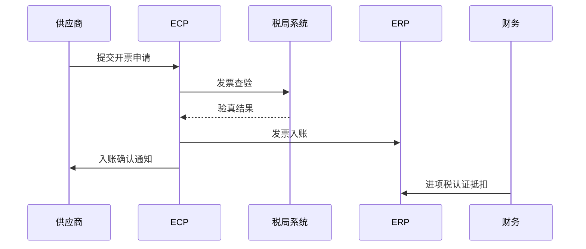

# ECP发票与税务管理

> 电子商城发票税务模块产品设计笔记
> 涵盖全电发票（数电票）支持

## 一、业务全景

ECP发票管理覆盖：

```
采购订单 → 供应商开票 → 发票验真 → 发票入账 → 抵扣/归档
                                          ↓
                                     进项税抵扣
```

### 1.1 发票类型

| 类型 | 适用 | 说明 |
|------|------|------|
| 增值税专用发票 | 一般纳税人 | 可抵扣进项税，核心场景 |
| 增值税普通发票 | 小规模纳税人 | 不可抵扣 |
| 全电发票（数电票） | 国网全面推广 | 无纸化，税务数字账户 |
| 电子发票 | 通用 | PDF/OFD格式 |
| 纸质发票 | 过渡期 | 需扫描上传 |

## 二、核心功能

### 2.1 供应商开票

| 场景 | 流程 | 优先级 |
|------|------|--------|
| 订单→开票 | 供应商在ECP发起开票，引用采购订单 | P0 |
| 批量开票 | 多笔订单合并开票 | P1 |
| 红冲 | 退货/退款→开红字发票 | P1 |
| 预付款发票 | 预付款场景先开票后供货 | P1 |

### 2.2 发票验真

**推荐**：对接**国家税务总局全国增值税发票查验平台**或第三方验真服务（票通、百望云等）。

| 验真项 | 说明 |
|--------|------|
| 发票代码/号码校验 | 发票号段有效性 |
| 金额一致性 | 发票金额与订单/结算单金额比对 |
| 购买方名称 | 与国网公司名称一致 |
| 税号匹配 | 统一社会信用代码一致 |
| 重复报销检查 | 同一张发票不被多次使用 |

### 2.3 发票入账与抵扣



| 功能 | 说明 | 优先级 |
|------|------|--------|
| 发票入账 | 与ERP应付模块联动 | P0 |
| 进项税管理 | 可抵扣/不可抵扣分类 | P1 |
| 认证抵扣 | 对接税局认证系统 | P1 |
| 发票归档 | 电子发票原文件存储+检索 | P0 |

## 三、数电票（全电发票）适配

国网系统正在全面推广数电票，ECP必须适配：

### 3.1 数电票特点

| 传统发票 | 数电票 |
|---------|--------|
| 需税控设备 | 无需税控设备 |
| 纸质/PDF | 纯数字，XML格式 |
| 发票代码+号码 | 20位数字号码 |
| 购买方需提供完整信息 | 只需纳税人识别号 |
| 需手动查验 | 自动赋码，查验简化 |

### 3.2 兼容方案

```
ECP应同时支持：
1. 传统发票（专票/普票/电子发票）
2. 数电票（纯XML格式）
3. 数电票PDF展示版

接口标准化：
- 统一发票接口层（抽象发票类型差异）
- 对接多种开票通道（百望云/票通/税局直连）
```

## 四、ECP与ERP的发票集成

```
ECP发票模块                    DAP-S 财务模块
  开票申请 ──────→   应付暂估/正式发票
  发票入账 ←──────   会计凭证编号回传
  进项税  ──────→   进项税分类管理
  付款匹配 ←──────   付款单完成回传
```

## 五、发票报表

| 报表 | 用途 |
|------|------|
| 进项发票汇总表 | 按供应商/期间展示待认证/已认证发票 |
| 发票异常报表 | 验真失败/金额不一致/重复报销 |
| 开票进度表 | 供应商已开票 vs 应开票对比 |
| 税负分析 | 按物料分类的进项税分析 |

## 六、分阶段建议

| 阶段 | 功能 | 依赖 |
|------|------|------|
| Phase 1 | 发票登记+验真+入账（兼容数电票） | 对接税务验真接口 |
| Phase 2 | 开票流程+批量操作+红冲 | 对接开票通道 |
| Phase 3 | 智能税负分析+自动抵扣 | ERP数据打通 |
